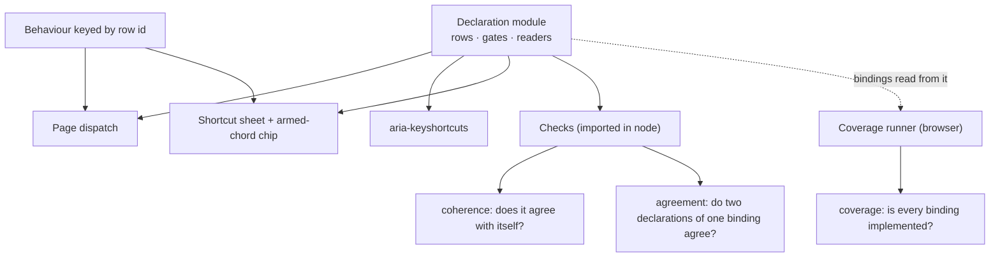

# Session Recap & Retrospective — Declared Keyboards

> **Scope.** This is the second retrospective on this repository. The first
> ([`RETROSPECTIVE.md`](RETROSPECTIVE.md), 2026-09-02) covered the original
> two-site build. This one covers the session that turned the keyboard into a
> **declared, checked artifact** across every surface in the app — five
> declarations, two shared checkers, three findings that were real bugs, and one
> blinded check of the checkers themselves.
>
> **Window.** 2026-09-27 20:32 → 2026-09-28 01:37 (14 commits, plus the ladder
> work still in the working tree). Branch `main`, 63 commits ahead of
> `origin/main`, nothing pushed.

---

## 0. Executive summary

1. **A keyboard is data.** Every surface that binds keys now declares them in one
   import-free module and *reads* that declaration for all four of its consumers:
   the dispatcher, the shortcut sheet, the `aria-keyshortcuts` attributes, and the
   armed-chord menu. Drift between "what is bound" and "what is documented" stopped
   being unlikely and became impossible.
2. **Three properties are checked, and each can only be asked of a different
   thing:** the declaration against *itself* (coherence), two declarations that
   describe *one binding* against each other (agreement), and the declaration
   against *the running page* (coverage).
3. **The checks found real bugs, one per new surface.** A dead Escape back-out
   (Radix dismisses on `document` in the *capture* phase), a form whose Escape
   closed the panel behind it, a shortcut sheet that promised `Ctrl+K` while the
   palette answered a key the row did not carry, and a duplicate Escape listener
   that made two components co-owners of one press.
4. **The checkers were themselves checked.** A mutation aimed at the coverage
   runner *passed* — a binding that names no key is pressed zero times, so its
   exercise never ran. That blind spot is now refused before a browser opens.
5. **Vacuity was the recurring enemy.** "A check that walks no state cannot
   fail", "a comparison of nothing reads green", "a binding with no key is
   exercised by nobody" — three separate guards, each added because a real
   version of the failure existed.

| Metric | Value |
|---|---|
| Commits in the era | 14 (0 unsaved; ladder work uncommitted) |
| Declared keyboards | 5 modules, 1,410 lines |
| Shared checkers | `keyboard-coherence.ts` (700) + `keyboard-coverage.ts` (115) |
| States enumerated & walked | 77 real states across 5 surfaces (+12 on a synthetic keyboard) |
| Broken-manifest cases in the checkers' own spec | 21 manifest mutations + 7 pair mutations = 28 (counted from the spec by `linkedin/stats.mjs` — this row said 20 + 7 until the count was derived) |
| `aria-keyshortcuts` attributes built from a declaration | 5, across 4 components |
| Components that read a declaration | 6 |
| e2e suite | **130 tests, 18 files** |
| Bugs found by declaring a surface | 4 (+1 UI bug reported, unfixed) |

---

## 1. The product this sits inside, in one page

```
                       ┌──────────────────────────────────────────────┐
   Galaxy  (dark)      │  /            explainer landing (light)      │
   the flagship        │  /galaxy      3D star field + overlays       │
                       │  /system-map  architecture view              │
                       │  /methodology research trail                 │
                       └──────────────────────────────────────────────┘
   FinBench            ┌──────────────────────────────────────────────┐
   eval harness        │  /finbench        run explorer + filter bar   │
                       │  /finbench/tasks/[taskId]                    │
                       └──────────────────────────────────────────────┘
   Delegate            ┌──────────────────────────────────────────────┐
   workshop sim        │  /delegate            participant workspace   │
   (light, mono)       │  /delegate/facilitator  the console           │
                       └──────────────────────────────────────────────┘
```

Three products, one token layer, one Playwright suite. The console
(`/delegate/facilitator`) is where the keyboard work started, because it is the
one surface in the app that was *designed* around keys: a walk (`j`/`k`), a
transport (`←`/`→`, `Home`/`End`), a commit (`Enter`/`w`), a namespace of five
chords (`g i`, `g n`, `g w`, `g l`, `g v`), a shortcut sheet, a live region, and
two overlays layered over all of it.

---

## 2. What the session actually did

The single sentence behind all of it: *a binding written down twice is a claim
nothing can check.*

| # | Commit | The question it answered | What it found |
|---|---|---|---|
| 1 | `51dfd5e` | Declare the console's keys once, for the page, the sheet and aria | The sheet, the key map, the chip menu and four `aria-keyshortcuts` strings were four hand-written copies |
| 2 | `82fe7a2` | Bind Escape to the topmost layer | One Escape closed the panel **and** the watch pane: Radix flips a layer to `data-state="closed"` before the page's bubble listener asks who owns the key |
| 3 | `f1b420e` | Scroll the cursor row into view when the walk moves | Every bound key suppresses browser scrolling, so the ring could travel below the fold — announced, never seen |
| 4 | `4927c6b` | Cap what the grid renders, keep the room reachable past it | A store-shaped DOM; the walk, counters and deep links must still reach what the window is not drawing |
| 5 | `28eaa07` | Move the `g` namespace into the declaration | A chord documented but not bound was possible in principle; now one row is both |
| 6 | `44e8de0` | Guard the declaration against its own incoherence | Two live bindings on one key, and gates nobody can reach or nothing reads |
| 7 | `16148d3` | Press every declared binding, demand a visible effect | A documented binding is documentation until something presses it |
| 8 | `2ec258d` | A documented reset for both delegate stores | The suite had been writing into the store a facilitator opens in dev |
| 9 | `20f2612`, `7c384dc`, `ab59bfb` | FinBench's way in from the landing page; the OG alt text; naming the CLI's readout | Product gaps around the keyboard work |
| 10 | `fb47baf` | Check **any** keyboard declaration from one harness | Generalised the console's spec into a contract; declared the advertising surfaces beside the keys |
| 11 | `f0acb5b` | Poll the address bar instead of racing its write | A flake that failed 1 run in 3 |
| 12 | `202973a` | Bring the delegate docs into the repo | Only generated readouts stay outside |
| 13 | `4d8dc48` | Declare the ⌘K palette's keyboard | **The Escape back-out was dead**, and two arrow chips advertised a key nothing binds |
| 14 | `bf3f42f` | Ask every declared keyboard the two questions a declaration cannot answer | The console's sheet promised `Ctrl+K` while the palette also answered it; the coverage runner gained its first clients |
| — | *working tree* | Declare the galaxy page's own dismissal ladder | **The sheet's Escape was bound twice**; the panel covers the bottom bar; the coverage runner could be walked through a binding with no keys |

The arc is visible in the commit subjects: they read as questions, because each
step was "what can this design not yet see?" rather than "add feature X".

---

## 3. Architecture: one declaration, four readers, three checks

```
                        ┌───────────────────────────────────────────┐
                        │  THE DECLARATION                          │
                        │  components/**/*Keys.ts                   │
                        │                                           │
                        │   row := { id, keys[], gate, under[],     │
                        │            mount, yieldKeys[] }           │
                        │   + gates(state) → boolean record          │
                        │   + readers: rowIsLive, layerIsLive,       │
                        │     liveKeyMap, liveShortcuts, armedChords │
                        │                                           │
                        │   no React · no DOM · no imports           │
                        └───┬────────┬─────────┬─────────┬──────────┘
                            │        │         │         │
             ┌──────────────┘        │         │         └───────────────┐
             ▼                       ▼         ▼                         ▼
      ┌─────────────┐      ┌──────────────┐  ┌───────────────┐  ┌────────────────┐
      │ DISPATCH    │      │ ADVERTISE    │  │ DOCUMENT      │  │ CHECK          │
      │ the page's  │      │ aria-        │  │ the shortcut  │  │ specs import   │
      │ handler /   │      │ keyshortcuts │  │ sheet / chip  │  │ the module in  │
      │ key map     │      │ (5 attrs)    │  │ (menu + dim)  │  │ node           │
      └─────────────┘      └──────────────┘  └───────────────┘  └────────────────┘
             ▲                                                          ▲
             │                                                          │
      ┌──────┴──────────────────────────────────────────────────────────┴──────┐
      │  BEHAVIOUR is the only thing a surface supplies: { rowId: { key: fn } } │
      └────────────────────────────────────────────────────────────────────────┘
```

Mermaid, for viewers that render it:



### The five declarations

| Module | Surface | Keys | Mounts used | Gates | States | Spec |
|---|---|---|---|---|---|---|
| `components/delegate/consoleShortcuts.ts` | facilitator console | 10 rows + 5 chords | `map`, `layer`, `primitive`, `global` | `room`, `watch`, `views`, `cursor` | 56 | `delegate-shortcuts.spec.ts` (8 tests) |
| `components/ui/commandPaletteKeys.ts` | ⌘K palette | 4 rows | `layer`, `primitive`, `global` | `open`, `subroute`, `emptySubroute` | 7 | `command-palette.spec.ts` (10) |
| `components/ui/companySearchKeys.ts` | galaxy company search | 4 rows | `layer`, `global` | `open`, `results` | 4 | `company-search-keys.spec.ts` (3) |
| `components/ui/savedViewsKeys.ts` | saved-views panel (both products) | 3 rows | `layer`, `primitive` | `open`, `form` | 4 | `saved-views-keys.spec.ts` (3) |
| `components/galaxy/galaxyKeys.ts` | the galaxy page's Escape ladder | 3 rows | `global` only | `open`, `add`, `selection` | 6 | `galaxy-keys.spec.ts` (3) |

What each new client added to the design's range — this is the interesting part
of the table, not its size:

- **console** — the full vocabulary: a key map, ordered layers, chords, yields,
  and advertising surfaces.
- **palette** — the first declaration with **no** key map and **no** chord
  namespace, so its honest readers are empty rather than stubbed. It also forced
  the difference between *allowed* sharing (the console's sheet owns Escape at
  every moment) and *stacked* sharing (`under: 'subroute'`).
- **search field** — the first row it **prints but does not bind**: Escape is the
  page's, so the row is `global` and the `esc` cap is rendered from it, because a
  hint is a claim too.
- **saved-views panel** — the first Escape that is *layered rather than allowed*:
  the form's Escape steps back, only the list's dismisses, and the dismissal
  lives `under: 'form'`.
- **galaxy ladder** — the first declaration whose bindings are **all**
  page-level, which needed `under` to name a *list* of gates and the harness to
  gain a collision mechanism for rows nothing mounts.

---

## 4. The three checks, and what each one cannot see

| Check | Question | Lives in | Can see | Cannot see |
|---|---|---|---|---|
| **Coherence** | Does the declaration agree with itself? | `e2e/keyboard-coherence.ts` + a spec's worlds | Two live bindings on one key, per mechanism; unreachable/unread/bogus gates; the namespace; what a surface advertises vs what it mounts | Anything about the page. It assumes the page implements the whole declaration |
| **Agreement** | Do two declarations of *one* binding describe it the same way? | same harness, `agreement()` | keys (as a set), gate, `under`, mount, `yieldKeys` | What each surface calls the binding (ids, labels, display) — deliberately out of scope |
| **Coverage** | Is every declared binding actually implemented? | `e2e/keyboard-coverage.ts` | A binding with no exercise, an exercise with no binding, a binding that names no key, and a key that does nothing visible | Whether the declaration is *right* — it only presses what is declared |

```
                 ┌──────────────────────────────────────────────────┐
                 │                                                  │
   "is it true?" │   COHERENCE          AGREEMENT          COVERAGE  │  "is it wired?"
                 │      ▲                   ▲                  ▲    │
                 │      │                   │                  │    │
                 │  one manifest        two manifests       manifest │
                 │  + its states        + a stated pair     + a real │
                 │                        of ids             browser │
                 │                                                  │
                 └──────────────────────────────────────────────────┘
        blind spots:      page behaviour      surface vocabulary    declaration accuracy
```

### The vacuity guards (all three paid for themselves)

| Guard | The failure it refuses |
|---|---|
| *"no worlds were enumerated, and a check that walks no states cannot fail"* | An enumeration that came back empty makes every assertion built on it true |
| *"no shared bindings were named, and a check that compares nothing cannot fail"* | A pairing list emptied by a rename compares nothing and reads green |
| *"no declared binding may name zero keys, and be exercised by nobody"* | The coverage runner iterates declared **keys**, so a row with none is walked past without a press — found by mutation, not by reading |
| Behaviour withheld rather than compared | Two readers built from one predicate agree **by construction**, so a wrong predicate is invisible to a comparison of its own outputs; the chip/map check asks for **presence** instead |

---

## 5. The Escape problem, in sequence

The single most instructive bug in this session, and it arrived three times.

```mermaid
sequenceDiagram
  participant U as User
  participant R as Radix DismissableLayer
  participant F as The form/input handler
  U->>R: Escape (keydown)
  Note over R: listener is on DOCUMENT, phase = CAPTURE
  R->>R: onEscapeKeyDown?.(event)
  alt handler called preventDefault()
    R-->>U: layer stays open (the app's branch wins)
  else nobody claimed it
    R->>R: event.preventDefault(); onDismiss()
    R-->>U: the overlay closes
  end
  R->>F: (bubble phase, too late to matter)
  F->>F: the input's own onKeyDown
```

Plain text: **capture on `document` beats bubble on the input.** A dismissible
library answers Escape before any React handler on the element inside it. So:

| Surface | The claim | Where it must be decided |
|---|---|---|
| Console | Escape closes the views panel, else the watch pane, else the sheet | The shared policy, which hands Escape to the layer holding the focused element |
| ⌘K palette | Escape from a sub-list returns to the root menu; only the root dismisses | `onEscapeKeyDown` on the dialog — the old bubble handler was **dead** |
| Saved-views panel | Escape in the form returns to the list; the list's Escape dismisses | `onEscapeKeyDown` on the popover content |
| Galaxy page | Escape closes the search, else the sheet, else the selection | The page's own window listener, declared as a ladder |

The declaration is where this stops being folklore: `under: 'subroute'` /
`under: 'form'` / `under: ['open', 'add']` is exactly the sentence "the same key,
in two states, and which one is live is a fact about the state rather than about
listener order".

---

## 6. The ladder — a dismissal chain as a truth table

`components/galaxy/galaxyKeys.ts`, all three rows on `Escape`, all `mount: 'global'`:

| State (search · sheet · selection) | Row that answers | Why not the others |
|---|---|---|
| open · shut · any | `close-search` | top rung |
| shut · open · any | `close-add-form` | `under: ['open']` |
| shut · shut · selected | `clear-selection` | `under: ['open', 'add']` |
| shut · shut · nothing | *none* | the bottom rung is gated on there being something to drop |

Two facts make this checkable rather than merely stated:

1. `under` names a **list**, because a ladder means "every rung above me is
   shut" — a single gate says "one layer above me", which is the pairwise stack.
2. The harness gained a **page-level collision mechanism**: a row the page binds
   itself answers from a listener the component wrote, so two of them live at
   once is again whichever listener the browser registered second, and no layer
   stack can separate rows that nothing mounts.

Dropping one element of the bottom rung's list produces, in node:

```
search=true add=false selected=true: two rows the page binds itself both answer Escape
(close-search and clear-selection)
```

---

## 7. Findings ledger

| # | Symptom | Root cause | How it was found | Proof | What catches it now |
|---|---|---|---|---|---|
| 1 | Escape from a palette sub-list closed the whole palette | Radix dismisses on `document` **capture**; the input's bubble `preventDefault` could never win | Declaring the row and asking where it is live | Spec: Escape leaves a sub-list and only closes from the root | `back-to-root` `under: 'subroute'` + coverage step |
| 2 | Escape in the saved-views form closed the panel behind it | Same capture-phase shape, unmeasured | The declaration put the branch on the layer | Mutation: with the layer handler inert, one press closed the form **and** the panel | `back-to-list` + coverage's "panel is still visible" |
| 3 | The sheet promised `Ctrl+K` | The console's row carried `Meta+k` only, while the palette answered both | The agreement check, the first time it ran on real declarations | Exact message: *describe one binding with different keys ([Meta+k] and [Control+k Meta+k])* | `agreement()` in `delegate-shortcuts.spec.ts` |
| 4 | Two arrow chips advertised a navigation key | cmdk binds ArrowDown/Up/Home/End/Enter — `ArrowRight` appears nowhere in its dist | The manifest could not honestly include it | Chips became icons: an affordance without a key claim | The declaration would have flagged an unbacked advertised key |
| 5 | One Escape closed two layers | A layer flips to `data-state="closed"` before the page's bubble listener asks who owns the key | Measured on the popover, the sheet and the palette | Spec case simulating both shapes a dismissal takes | Policy: the layer holding focus owns the key |
| 6 | The sheet's Escape fired twice per press | The sheet had its own window listener *and* the page's ladder bound it | Declaring the page's own bindings | Removed; the page is the single owner | Page-level collision check + coverage steps |
| 7 | The coverage runner could be walked through a binding | It iterates declared **keys**; a row with none gets no press and its exercise never runs | A mutation that *passed* — the only reason the hole is known | New guard fails before a browser opens | The runner's own zero-key guard (5 clients inherit it) |
| 8 | The bottom bar's Search is unclickable with a profile open | The profile panel (`z-30`, full height, fixed right) covered that end of the bar | The coverage step's click retried for 4.5 minutes on "subtree intercepts pointer events" | **Fixed**: the drawer now stops at the bar's declared height, so all four controls are clickable with a profile open | A hit test at each control's CENTRE with the panel open (`elementFromPoint`, naming what is in front of it), plus the coverage step clicking again — mutation-proved by putting the panel back to `bottom-0`, which failed as `"Reset view" sits at 1055,856 88×32 but SPAN.text-ui-dim is in front of it` |

Plus the honest limits recorded in the code rather than papered over:

- The harness's `unimplemented` list reads a key map or a chord menu; the
  palette, search, saved-views and ladder surfaces have neither, so that list is
  asserted nowhere for them.
- The ladder's middle rung (`under: ['open']`) is declarative, not load-bearing:
  the bottom bar closes each overlay to open the other, so the two never
  co-occur. The array's `add` element *is* load-bearing in a reachable state.
- **The design can only see keys the app owns.** FinBench's filter popover binds
  nothing app-owned — it is a cmdk list inside a Radix popover, so its
  arrows/Enter/Escape belong to those libraries. Declaring them would be a lie in
  the other direction.

---

## 8. The biggest learnings

**L1 — Move the binding into data and the drift disappears, because there is
only one copy left.** Ten console rows, five chords, four `aria-keyshortcuts`
strings, a key map, a chip menu and a sheet: all read from
`consoleShortcuts.ts`. The test of the design is not "no duplicates today" but
"can a duplicate be introduced?" — and here, adding a row without an exercise
fails the coverage runner, and adding a chord without behaviour fails the hook's
map.

**L2 — A toggle owes both halves, and nothing tests the closing half.** The
palette's own spec opened it with Ctrl+K and closed it with Escape, so a palette
that could only ever open would have passed every test in the repo. The coverage
runner presses the row's keys *with the surface showing* and demands it
disappear.

**L3 — A check cannot be trusted until it has been made to fail.** Every claim in
this session was proven by a mutation that died on the *exact assertion it was
aimed at* — and the mutation that didn't (emptying a row's keys) is the one that
found a hole. Corollary learned the hard way: **the mutation must be type-legal**,
or `next build` fails the webServer instead of the test, and you have proven
nothing about the test.

**L4 — Two readers of one predicate always agree, so compare outputs, not
agreement.** The chip and the hook could have disagreed about which chords were
dispatchable; they share a predicate, so a comparison between them is vacuous.
The check *withholds* a behaviour and demands it be absent from the map and the
menu — presence, not agreement.

**L5 — Agreeing about a binding means agreeing about its facts, not its
words.** Keys are compared as a *set* (listing alternatives in another order is a
rendering choice), while ids, labels and display strings are excluded because
those are how each surface speaks to its own readers. But the **gate name is a
fact**: when the galaxy ladder declared its rung under `search` and the field had
declared it under `open`, the check failed — correctly. Two names for one state
is a disagreement, not a dialect.

**L6 — Layer order is a claim about the DOM's timing, not about your `if`s.**
Radix dismisses on `document` in the capture phase. Any surface whose Escape
branch must run first has to take it in the layer's own handler — and then say so
in the declaration, or the next reader will "simplify" it back into the input.

**L7 — A taxonomy of mounts is what makes "who answers this key?" answerable.**
`map` (one key map) · `layer` (ordered, stackable) · `primitive` (the overlay's
own dismissal, which the surface does not write) · `global` (a listener
somewhere else entirely, which is what `mount: 'global'` means on *both* sides of
an agreement pair). Four mechanisms, each failing differently, each checked on
its own terms.

**L8 — Vacuous green is the default failure mode of a self-check, so name it.**
An enumeration with no states, a pairing with no pairs, a binding with no keys, a
comparison of two identical readers: all four pass. Each now returns a sentence
saying why it cannot fail.

**L9 — The checkers need their own client.** A harness run only against the
console has been shown to fit the console; it has not been shown to be a harness.
So the harness carries a synthetic keyboard of its own, coherent and then broken
20+7 ways, and the two "one declaration" checks it cannot bite on real modules
biting there instead.

**L10 — The declarations are an instrument, not just a refactor.** Four of the
five new surfaces produced a real bug on the day they were declared: the palette's
dead Escape, the saved-views panel's double dismissal, the console's `Ctrl+K`
omission, the sheet's duplicate listener. Writing down what you believe is a
debugging technique.

**L11 — Recording a limit beats papering over it.** "This surface advertises no
key"; "this rung is declarative, not load-bearing"; "the coverage runner cannot
see whether the declaration is right" — each is written where a reader will meet
it. A check that pretends to cover something it cannot is worse than an admitted
gap, because the gap gets trusted.

**L12 — Evidence hygiene is part of the refactor.** Every mutation was restored
byte-identically (`md5` verified, no marker strings left), which caught a file
that had silently become mode `755` during a restore — a change that would have
ridden along into a commit. Staging was by exact path, never `git add -A`, in a
checkout other threads are editing.

---

## 9. Process mappings

### The loop this session converged on

```
   ┌──────────────────────────────────────────────────────────────────────────┐
   │                                                                          │
   ▼                                                                          │
 DECLARE ──▶ WIRE ──▶ ENUMERATE ──▶ CHECK ──▶ PAIR ──▶ PRESS ──▶ MUTATE ──────┘
   │          │          │           │         │         │          │
   │          │          │           │         │         │          └ prove each
   │          │          │           │         │         │            check can fail
   │          │          │           │         │         └ demand a
   │          │          │           │         └ compare two        VISIBLE effect
   │          │          │           │           declarations
   │          │          │           └ coherence in node (ms)
   │          │          └ the reachable states + the invariant
   │          └ the page reads it; behaviour is the only thing supplied
   └ rows, gates, mounts, `under`, readers — no React, no imports
```

Cheap-first is deliberate: coherence and agreement run in **node in
milliseconds**, coverage costs seconds-to-minutes in a browser, and the mutation
pass is manual. A declaration that contradicts itself fails before a browser
opens.

### Where this maps onto practices you would otherwise name separately

| Practice | Where it shows up here | The failure it prevented |
|---|---|---|
| Single source of truth / DRY | one declaration read four ways | A sheet documenting a key the page cannot perform |
| Contract testing | `KeyboardManifest` = data + the readers that interpret it, handed over unchanged | A second copy of the rules in the test that would agree with a wrong page |
| Property-based enumeration | `reachableWorlds(facts, accept)` — the surface declares its facts and its invariant | A hand-written table of "cases someone thought of" |
| Mutation testing | dozens across the era — three in the closing turn, each dying on its intended assertion, and one *not* dying for a reason worth having | A check that reads green for the wrong reason |
| Four-eyes / dual control | `agreement()` across two declarations of one binding | The console's sheet promising `Ctrl+K` the row did not carry |
| A11y as a checked claim | 5 `aria-keyshortcuts` attributes built from rows | Arrow chips advertising `→`, a key nothing binds |
| Regression discipline | coverage runner: one exercise per declared binding, both directions | A documented binding that nothing presses |
| Release hygiene | byte-identical restores, exact-path staging, clean status | A mode-755 file entering a commit |
| Honest limits | comments and README record what a check cannot see | Trust placed in a vacuous check |

### Ownership (who answers what, in the system as built)

| Fact | Owned by |
|---|---|
| Which keys exist, under which gate, on which mount | the declaration module |
| What each key *does* | the component (behaviour keyed by row id) |
| Whether two bindings can collide | `keyboard-coherence.ts`, run in node |
| Whether two declarations agree | `agreement()`, with the pairing stated by a spec |
| Whether a binding is implemented | `keyboard-coverage.ts`, in a browser |
| What a key is supposed to *mean* | the surface's own spec, against its own DOM |
| What covers what | README's conventions section + the module headers |

---

## 10. How to verify any of this yourself

```bash
npx playwright test --list                    # 130 tests, 18 files
npx playwright test e2e/keyboard-coherence.spec.ts        # the checkers on a fake keyboard
npx playwright test e2e/galaxy-keys.spec.ts               # one declaration end to end
npx playwright test e2e/facilitator-keys.spec.ts e2e/command-palette.spec.ts \
  e2e/company-search-keys.spec.ts e2e/saved-views-keys.spec.ts e2e/delegate-shortcuts.spec.ts
npx tsc --noEmit && npx eslint app components e2e lib store types playwright.config.ts
```

The interesting run is the second one: it breaks a synthetic manifest 27 ways and
names the list each break has to land in.

---

## 11. Open threads

1. ~~**The occluded bottom bar** on `/galaxy`~~ — **fixed.** The profile
   drawer reached `bottom-0` at `z-30` over the bar's `z-20`, so with a profile
   open all four controls were behind an opaque panel: a mouse user could not
   search, add a company, share or reset while reading a profile. The bar's
   height is now declared once (`--bottom-bar-h`, `app/globals.css`) and the
   drawer and toast stack offset by that token, so chrome is never the thing
   that gives way. What remains is the general lesson rather than the bug:
   nothing else in the suite (or in the harness) asks whether a control is
   *reachable* — every other check asks whether a key does something, which is
   the vocabulary that had no word for "the click lands on something else".
2. **The participant composer** (`app/delegate/page.tsx`, `Enter` sends,
   `Shift+Enter` is a guard against a newline an `<input>` cannot produce) — the
   last app-owned binding in the Delegate product with no declaration. Its
   behaviour already guards empty drafts, so the declaration is honest work
   rather than a bug hunt.
3. **`unimplemented` for surfaces with no key map** — either give those surfaces
   something to compare, or state the limit once in the harness instead of in
   four module comments.
4. **Finish the `/galaxy` extraction**: the ladder is declared, but the search
   field and the add-company sheet still hold their own render-side hints; one
   place could render every hint on the page from its declaration.
5. **The branch is 63 commits ahead with nothing pushed** — the whole era is
   local.

---

## 12. Glossary (the vocabulary this design introduced)

| Term | Meaning |
|---|---|
| **row** | one binding: `id`, `keys[]`, `gate`, `under[]`, `mount`, `yieldKeys[]` |
| **gate** | a named boolean of the surface's state that decides whether a row is live |
| **under** | the gate(s) a row stands down for — the pairwise stack, or a ladder |
| **mount** | how a key reaches the keyboard: `map` · `layer` · `primitive` · `global` |
| **yield** | a key a row gives back while one of the surface's own controls holds the keyboard |
| **world** | one reachable state, produced by the cross product of the surface's facts filtered by its invariant |
| **withheld** | behaviour the spec deliberately does not implement, so a check can prove a dead key is neither kept nor offered |
| **allowedSharedKeys** | keys two *different* mechanisms may legitimately both claim (an overlay's own dismissal) |
| **agreement** | the comparison of two declarations that describe one binding, on facts only |
| **coverage** | the property that every declared binding, and every key of one, does something visible |
| **advertising surface** | an element whose `aria-keyshortcuts` (or menu) makes a claim about what is bound |
